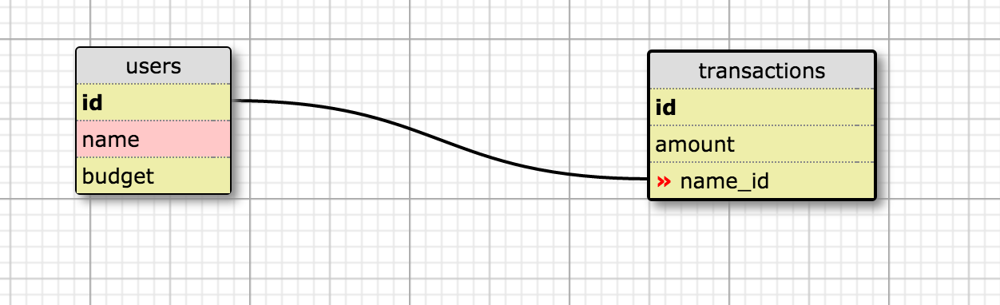

# _BUDget_

#### _Java Week 5 Team Week Code Project Epicodus 2016_

#### By _**Elissa Sosland, Joshua Logan, Cory Franks, Anthony Gold**_

## Description
```
_This is a Java web app for budgeting cannabis that lets a user view and add to a list of transactions, as well as click on users and view or add transactions for users. The input is stored in a database._
```

##Database Tables


## Setup/Installation Requirements

* _SETUP THE DATABASE:_
* _Clone the repository_
* _Use console to enter directory_
* _In a new console window run the command 'postgres' and keep running_
* _In bash console run the command 'psql budget < budget.sql'_
* _In a new console window run the command 'psql' and run commands below:_
* _'CREATE DATABASE budget;' and then run '\c budget;' to connect to the database_

* _DATABASE CREATED BY THESE COMMANDS:_
* _'CREATE TABLE users (id serial PRIMARY KEY, name varchar, budget int);'_
* _'CREATE TABLE transactions (id serial PRIMARY KEY, amount int, user_id int);'_
* _'CREATE DATABASE budget_test WITH TEMPLATE budget;'_

* _RUN THE WEB APP:_
* _In bash console command 'gradle run'_
* _Open http://localhost:4567/ in web browser_

## Known Bugs

_No known bugs at this time_

## Technologies Used

_Java, SQL, Spark, Velocity, FluentLenium, Bootstrap, HTML, CSS, Gradle, JUnit_

### License

The MIT License (MIT)

Copyright (c) Soslandia 2016

Permission is hereby granted, free of charge, to any person obtaining a copy
of this software and associated documentation files (the "Software"), to deal
in the Software without restriction, including without limitation the rights
to use, copy, modify, merge, publish, distribute, sublicense, and/or sell
copies of the Software, and to permit persons to whom the Software is
furnished to do so, subject to the following conditions:

The above copyright notice and this permission notice shall be included in all
copies or substantial portions of the Software.

THE SOFTWARE IS PROVIDED "AS IS", WITHOUT WARRANTY OF ANY KIND, EXPRESS OR
IMPLIED, INCLUDING BUT NOT LIMITED TO THE WARRANTIES OF MERCHANTABILITY,
FITNESS FOR A PARTICULAR PURPOSE AND NONINFRINGEMENT. IN NO EVENT SHALL THE
AUTHORS OR COPYRIGHT HOLDERS BE LIABLE FOR ANY CLAIM, DAMAGES OR OTHER
LIABILITY, WHETHER IN AN ACTION OF CONTRACT, TORT OR OTHERWISE, ARISING FROM,
OUT OF OR IN CONNECTION WITH THE SOFTWARE OR THE USE OR OTHER DEALINGS IN THE
SOFTWARE.
